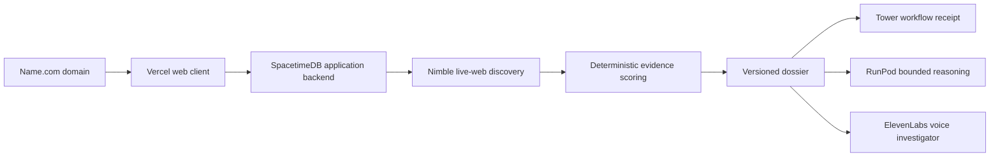

# Spectre-DW

Spectre-DW turns public identity signals into reviewable evidence dossiers.
Investigators can collect source-backed findings, inspect uncertainty, revisit
an analysis as public information changes, and discuss the dossier through a
private conversational investigator.

## Sponsor Backbone

Spectre-DW puts sponsor infrastructure inside the product's operating story,
where its contribution is visible and measurable.

| Sponsor | Role in Spectre-DW |
| --- | --- |
| [Nimble](https://www.nimbleway.com/) | Resolves focused identity queries against the live web and returns traceable public evidence. |
| [RunPod](https://www.runpod.io/) | Provides elastic model inference for open-ended, evidence-bounded dossier questions. |
| [Tower](https://tower.dev/) | Issues external workflow receipts so completed investigations leave an auditable operational trail. |
| [Name.com](https://www.name.com/) | Gives the project a credible domain and public launch identity. |

Nimble finds current evidence. Spectre scores it. RunPod expands bounded
reasoning when needed. Tower proves the workflow ran. Name.com gives the
experience a trustworthy public home.

## Product Capabilities

- Evidence-led investigation intake for names, profiles, handles, and websites.
- Focused live-web discovery with URL deduplication and identity-match filters.
- Deterministic source quality, chronology, diversity, and consistency scoring.
- Source-linked claims, risk gaps, recommendations, and confidence labels.
- Rollback-safe dossier revisits with revision history and source-change counts.
- Evidence-grounded dossier questions with deterministic and hosted responses.
- Private ElevenLabs voice conversations using short-lived server-side tokens.
- Durable investigation, evidence, operation, and voice-session records.
- Exportable reports and a local demo mode that requires no provider keys.

## Evidence Flow



Provider credentials never enter browser code. SpacetimeDB owns private
configuration, external requests, durable records, and rollback behavior.

## Reliability Contract

- A revisit never destroys a valid dossier when discovery fails.
- Evidence scores come from retained source metadata, not generated narrative.
- Every material claim remains connected to reviewable source evidence.
- Provider failures produce explicit operation states and safe fallbacks.
- Browser-exposed environment variables contain connection metadata only.
- Production builds fail when TypeScript validation or bundling fails.

## Repository Structure

```text
Spectre-DW/
|-- docs/                         Architecture and deployment runbooks
|-- integrations/
|   `-- tower/                    Tower workflow adapter
|-- public/                       Static brand assets
|-- spacetimedb/
|   `-- src/                      Tables, reducers, procedures, providers
|-- src/
|   |-- components/
|   |   |-- app/                  Shared application shell
|   |   |-- specter/              Product-specific experience
|   |   `-- ui/                   Reusable interface primitives
|   |-- contexts/                 Session and conversation state
|   |-- integrations/             Browser-side service clients
|   |-- lib/                      Investigation APIs and local demo store
|   |-- module_bindings/          Generated SpacetimeDB TypeScript bindings
|   |-- pages/                    Route-level screens
|   `-- types/                    Product domain types
|-- Towerfile                     Tower workflow declaration
|-- spacetime.json                SpacetimeDB project configuration
`-- vercel.json                   Production web deployment contract
```

Detailed boundaries and request flows live in
[`docs/architecture.md`](docs/architecture.md).

## Local Development

```sh
npm ci
npm run dev
```

Default `.env.example` values enable local demo mode. Copy only public
connection values into a local `.env.local`.

## Quality Gates

```sh
npm run typecheck
npm run lint
npm run build
npm run db:build
```

`npm run build` includes TypeScript validation and matches Vercel's production
build command.

## Live SpacetimeDB

Build bindings and publish backend:

```sh
npm run db:build
npm run db:generate
spacetime publish --server local spectre-dw
```

Public web configuration:

```env
VITE_DEMO_MODE="false"
VITE_SPACETIMEDB_URI="https://maincloud.spacetimedb.com"
VITE_SPACETIMEDB_DATABASE="spectre-dw"
```

Provider keys belong in owner-only SpacetimeDB configuration. Never prefix a
provider credential with `VITE_`.

Required provider placeholders are documented in [`.env.example`](.env.example).
Deployment settings are in
[`docs/vercel-deployment.md`](docs/vercel-deployment.md), and ElevenLabs agent
permissions are in [`docs/elevenlabs-setup.md`](docs/elevenlabs-setup.md).

## Provider Configuration

Use owner identity that published database:

```powershell
$name = '\"NIMBLE_API_KEY\"'
$value = '\"your-key\"'
spacetime call --server local spectre-dw configure_provider $name $value
```

Repeat for `RUNPOD_API_KEY`, `TOWER_API_KEY`, `TOWER_APP_NAME`,
`ELEVENLABS_API_KEY`, and `ELEVENLABS_AGENT_ID`.

RunPod remains reserved for open-ended dossier reasoning. Core evidence scoring
stays deterministic and does not require a generation pass.
