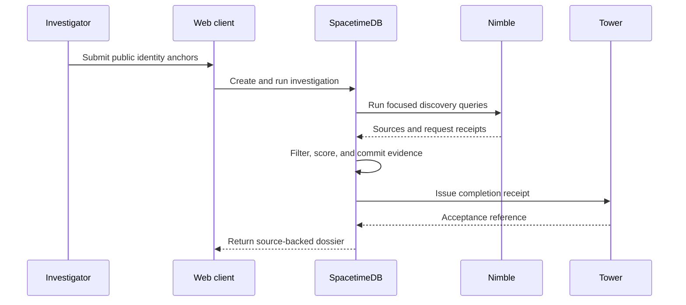

# Spectre-DW Architecture

## Design Goals

Spectre-DW separates evidence collection, deterministic assessment, durable
state, hosted reasoning, and presentation. This keeps provider failures from
silently changing conclusions and keeps private credentials outside browser
code.

## System Boundaries

| Boundary | Responsibility |
| --- | --- |
| Web client | Intake, report rendering, source review, revision controls, export, and voice controls. |
| SpacetimeDB module | Ownership, private configuration, transactions, external provider calls, evidence records, and rollback. |
| Nimble | Focused public-web discovery and request receipts. |
| RunPod | Optional open-ended answers bounded by retained dossier context. |
| Tower | External completion receipt for operational audit. |
| ElevenLabs | Authenticated conversational voice session. |
| Vercel | Static production delivery and SPA routing. |
| Name.com | Public domain identity and DNS entry point. |

## Investigation Lifecycle



## Revisit Transaction

A revisit reuses submitted identity anchors but never spreads stale analysis
fields into a new run.

1. Existing complete dossier and operation receipts are captured.
2. Investigation is marked running without deleting valid report content.
3. Public discovery and deterministic scoring run again.
4. New source URLs are compared with previous source URLs.
5. Successful output commits atomically with a new revision summary.
6. Failed discovery restores previous dossier and operation receipts.

Only five prior revision summaries are retained in compact record history.

## Security Model

- Browser receives only public SpacetimeDB URI and database name.
- Provider API keys live in owner-only SpacetimeDB rows.
- External provider calls execute inside SpacetimeDB procedures.
- ElevenLabs receives a short-lived conversation token, never its API key.
- Local storage contains a SpacetimeDB session token and no provider secret.
- Dossier exports contain findings and evidence references, not configuration.

## Source Layout

```text
src/pages                  Route-level composition
src/components/specter     Investigation and report features
src/components/ui          Generic UI primitives
src/lib                    Product API and demo persistence
src/integrations           Browser connection adapters
src/module_bindings        Generated database client contract
spacetimedb/src            Server-side domain and provider logic
integrations/tower         Tower workflow payload adapter
docs                       Operations and deployment guidance
```

## Deployment Contract

Vercel runs `npm ci` followed by `npm run build`. Build performs TypeScript
project validation before Vite emits `dist/`. `vercel.json` rewrites direct
route requests to `index.html`, preserving report and investigation deep links.

SpacetimeDB deploys independently. A frontend release does not migrate or
republish backend state.
